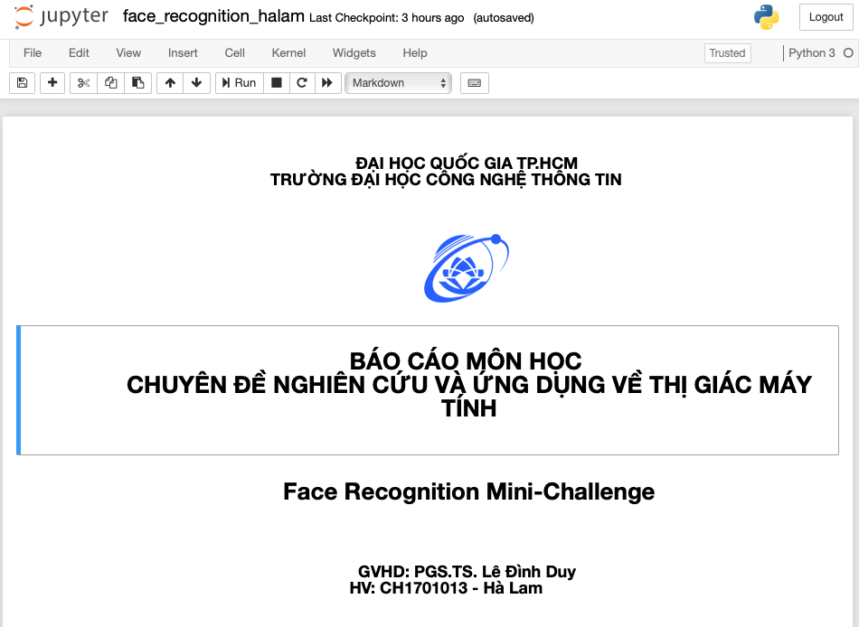

# BÁO CÁO MÔN HỌC CHUYÊN ĐỀ NGHIÊN CỨU VÀ ỨNG DỤNG VỀ THỊ GIÁC MÁY TÍNH

## Face Recognition Mini-Challenge

### Hướng dẫn sử dụng
Xin vui lòng download project để có giao diện chi tiết nhất có thể.
Trên github hiện tại không thể render hết được file .ipynb

### Video demo

### Tác giả
Hà Lam - CH1701013
### GVHD 
PGS.TS. Lê Đình Duy 

---
## Author

This repo was developed by [@lamha](https://github.com/HaLamUs). 
Follow or connect with me on [my LinkedIn](https://www.linkedin.com/in/lamhacs). 
